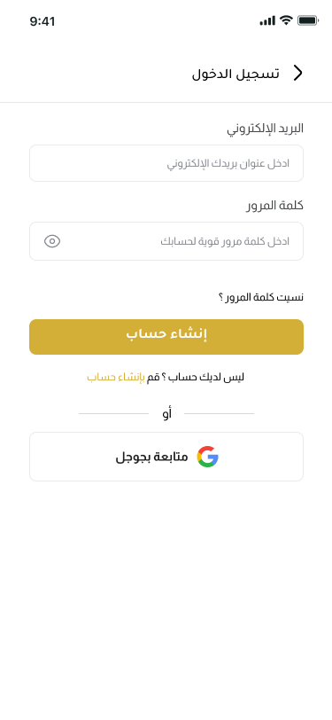
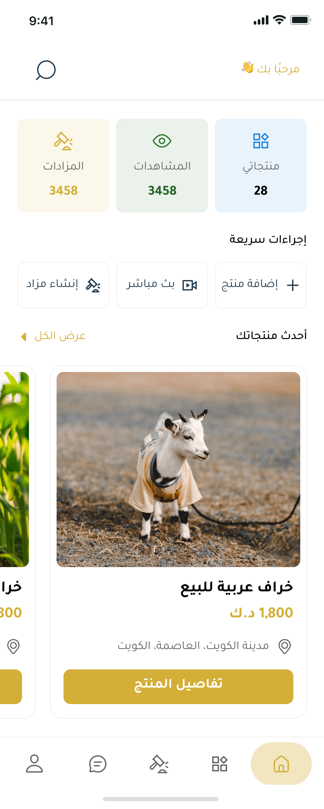
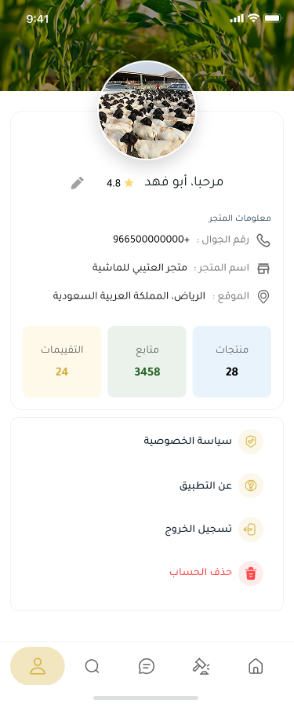
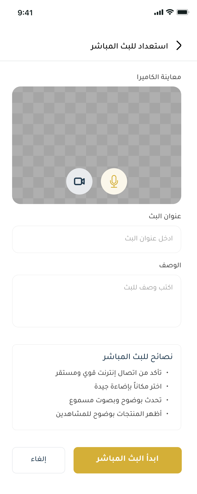
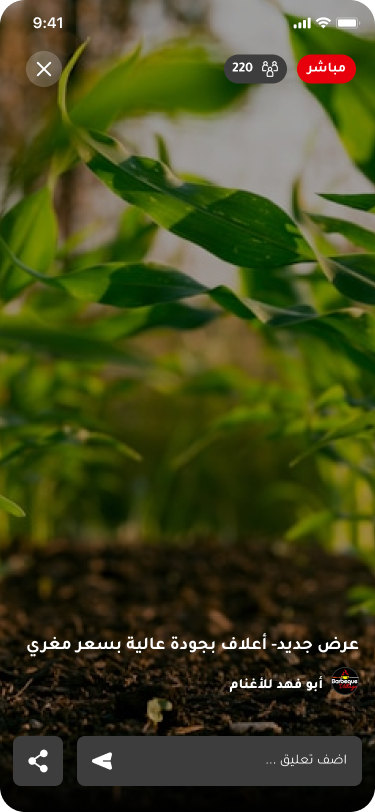
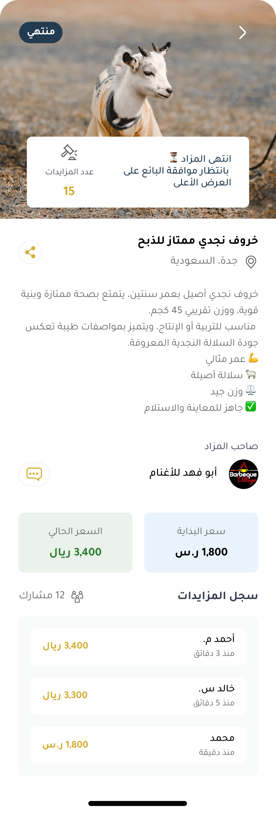
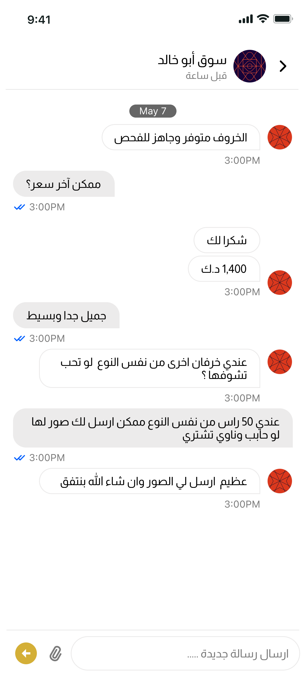

# Sheep App

تطبيق Sheep هو تطبيق Flutter مخصص لسوق المواشي، يربط بين البائعين والمشترين من خلال تجربة رقمية تشمل عرض المنتجات، إدارة المزادات، المتاجر، البث المباشر، المحادثات، والإشعارات.

## فكرة المشروع

يهدف التطبيق إلى تسهيل بيع وشراء المواشي عبر منصة منظمة تدعم أكثر من مسار استخدام:

- المشتري يستطيع تصفح المنتجات والمتاجر والمزادات والبثوث المباشرة.
- البائع يستطيع إضافة المنتجات، إدارة عروضه، إنشاء المزادات، ومتابعة بياناته.
- النظام يدعم التواصل بين المستخدمين عبر المحادثات والتنبيهات.

## أهم المميزات

- تسجيل الدخول وإنشاء الحسابات.
- دعم تسجيل الدخول عبر Google و Apple.
- عرض المنتجات وتصنيفها حسب الفئات والسلالات.
- إدارة منتجات البائع مع الصور والتفاصيل والحالة.
- عرض تفاصيل المنتج للمشتري.
- نظام مزادات للبائع والمشتري.
- بث مباشر باستخدام Agora.
- تعليقات وتفاعل أثناء البث المباشر.
- محادثات فورية باستخدام SignalR.
- إشعارات Firebase Cloud Messaging.
- متاجر وصفحات تفاصيل للمتجر.
- تخزين محلي لبعض بيانات المستخدم والتطبيق.
- دعم الصور والملفات والكاش.
- تصميم بواجهة عربية وخط Zain.

## لقطات من التطبيق

<table>
  <tr>
    <td align="center"><strong>تسجيل الدخول</strong></td>
    <td align="center"><strong>الرئيسية</strong></td>
    <td align="center"><strong>حسابي</strong></td>
  </tr>
  <tr>
    <td></td>
    <td></td>
    <td></td>
  </tr>
  <tr>
    <td align="center"><strong>تجهيز البث</strong></td>
    <td align="center"><strong>البث المباشر</strong></td>
    <td align="center"><strong>تفاصيل المزاد</strong></td>
  </tr>
  <tr>
    <td></td>
    <td></td>
    <td></td>
  </tr>
  <tr>
    <td align="center"><strong>المحادثات</strong></td>
    <td></td>
    <td></td>
  </tr>
  <tr>
    <td></td>
    <td></td>
    <td></td>
  </tr>
</table>

## التقنيات المستخدمة

- Flutter
- Dart
- Firebase Core
- Firebase Authentication
- Firebase Realtime Database
- Firebase Messaging
- Flutter Bloc / Cubit
- Dio و HTTP للتعامل مع APIs
- SignalR للمحادثات الفورية
- Agora RTC للبث المباشر
- Easy Localization
- Get Storage
- Image Picker و File Picker
- Cached Network Image
- Flutter Local Notifications

## هيكل المشروع

يعتمد المشروع على تنظيم قريب من Clean Architecture:

- `lib/core/data`: مصادر البيانات، الطلبات، والاستجابات.
- `lib/core/domain`: المستودعات وحالات الاستخدام.
- `lib/features`: واجهات وميزات التطبيق مثل المصادقة، المشتري، البائع، المتجر، المزادات، والبث.
- `lib/managment`: إدارة الحالة باستخدام Cubit/Bloc.
- `lib/util`: الثيم، الألوان، المسارات، التخزين، الأدوات، والودجت المشتركة.
- `assets`: الصور، الأيقونات، والخطوط.

## تشغيل المشروع

تأكد من تثبيت Flutter ثم نفذ الأوامر التالية:

```bash
flutter pub get
flutter run
```

## إعداد Firebase

المشروع يحتوي على ملف `firebase_options.dart` ويستخدم Firebase في المصادقة، قاعدة البيانات، والإشعارات. عند تشغيل المشروع على بيئة جديدة، تأكد من ضبط إعدادات Firebase للمنصات المطلوبة.

## المنصات المدعومة

- Android
- iOS

## حالة المشروع

المشروع قيد التطوير والتحسين، ويحتوي على البنية الأساسية لتطبيق سوق مواشي متكامل يدعم البيع، الشراء، المزادات، البث المباشر، والمراسلة.
